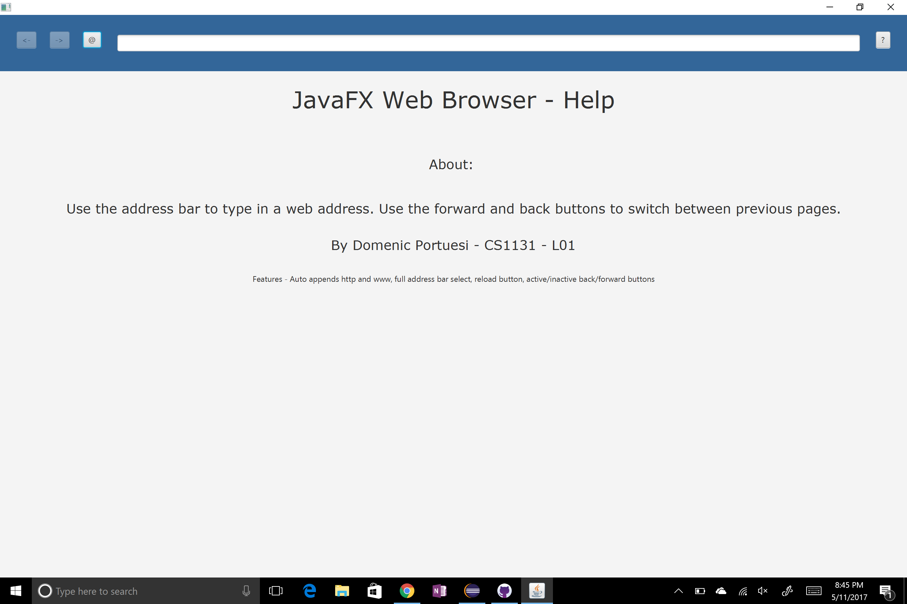
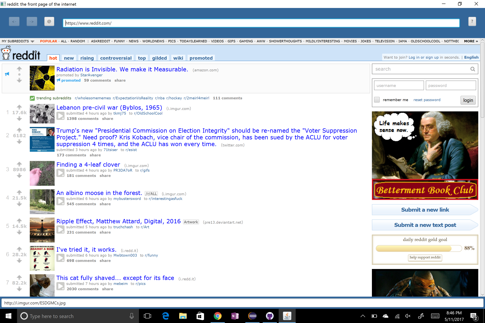

JavaFX Web Browser
==================

## A fully functioning web browser made in JavaFX. 

Created for an Accelerated Intro to programming course.

### Action shot:

### Features Include:
*	Faster loading than Internet Explorer (I actually tested this)
*	Fade-away back and forward browser buttons
*	Auto URL completion
*	URL box google searches
*	A home button incase you get lost in the web